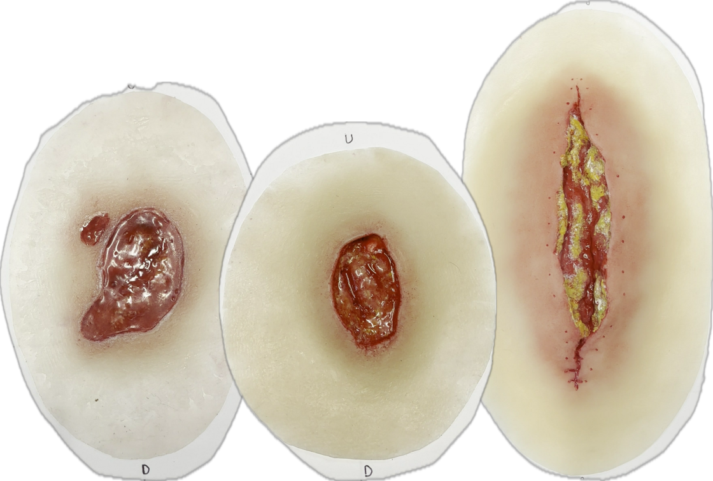
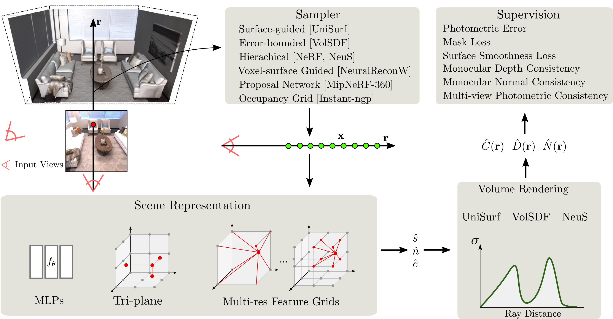

<p align="center">
    
    <h1 align="center">SALVE: A 3D Reconstruction Benchmark of Wounds from Consumer-grade Videos</h1>
    <h2 align="center">Paper accepted to WACV 2025</h2>
    <h3 align="center"><a href="https://remichierchia.github.io/SALVE/">Project Page</a> | <a href="">SALVE Dataset</a> | <a href="https://arxiv.org/abs/2407.19652">ArXiv (Preprint)</a> </h3>
    <!--  -->
</p>

# About

Welcome to the official repository for SALVE: A 3D Reconstruction Benchmark of Wounds from Consumer-grade Videos.

This repository contains:

- The code used to benchmark NeuS-facto, the top-performing method on our SALVE dataset, adapted from [SDFStudio](https://github.com/autonomousvision/sdfstudio).
- Preprocessing scripts for converting COLMAP outputs into a format compatible with SDFStudio.
- Postprocessing scripts to recover the translation used to center wounds within the rendering box.
- Evaluation_Code, which includes scripts for calculating accuracy and precision to replicate the results presented in our paper.

We encourage you to read the [SALVE](https://arxiv.org/abs/2407.19652) paper and stay tuned for updates on the dataset release!

# Quickstart

## 1. Installation: Setup the environment

### Please refer to SDFStudio repository for instruction on how to set up your own environment
```

## 2. Train your NeuS-facto model

```bash
# Train NeuS-facto with {data} in instant-ngp format and oprional scene scale {scale} for a better reconstructio
ns-train neus-facto --vis tensorboard --experiment-name {name} --output-dir /nas/home/chi215/Wounds/results_neusfacto_precision/ --pipeline.model.sdf-field.inside-outside False --pipeline.model.sdf-field.use-grid-feature True --pipeline.model.sdf-field.encoding-type hash --pipeline.model.sdf-field.num-layers 2 --pipeline.model.sdf-field.beta-init 0.3 --pipeline.model.sdf-field.bias 0.5 --optimizers.fields.optimizer.lr 0.01 --pipeline.model.eikonal-loss-mult 0.2 --trainer.save-only-latest-checkpoint False --trainer.steps-per-save 10000 --trainer.max-num-iterations 60000 --trainer.steps-per-eval-image 10000 --pipeline.datamanager.train-num-rays-per-batch 4096 instant-ngp-data --data {data} --scene_scale {scale}
```

# Citation

...coming soon...

<!-- If you use this library or find the documentation useful for your research, please consider citing:

```bibtex
@misc{Yu2022SDFStudio,
    author    = {Yu, Zehao and Chen, Anpei and Antic, Bozidar and Peng, Songyou and Bhattacharyya, Apratim 
                 and Niemeyer, Michael and Tang, Siyu and Sattler, Torsten and Geiger, Andreas},
    title     = {SDFStudio: A Unified Framework for Surface Reconstruction},
    year      = {2022},
    url       = {https://github.com/autonomousvision/sdfstudio},
}
``` -->
